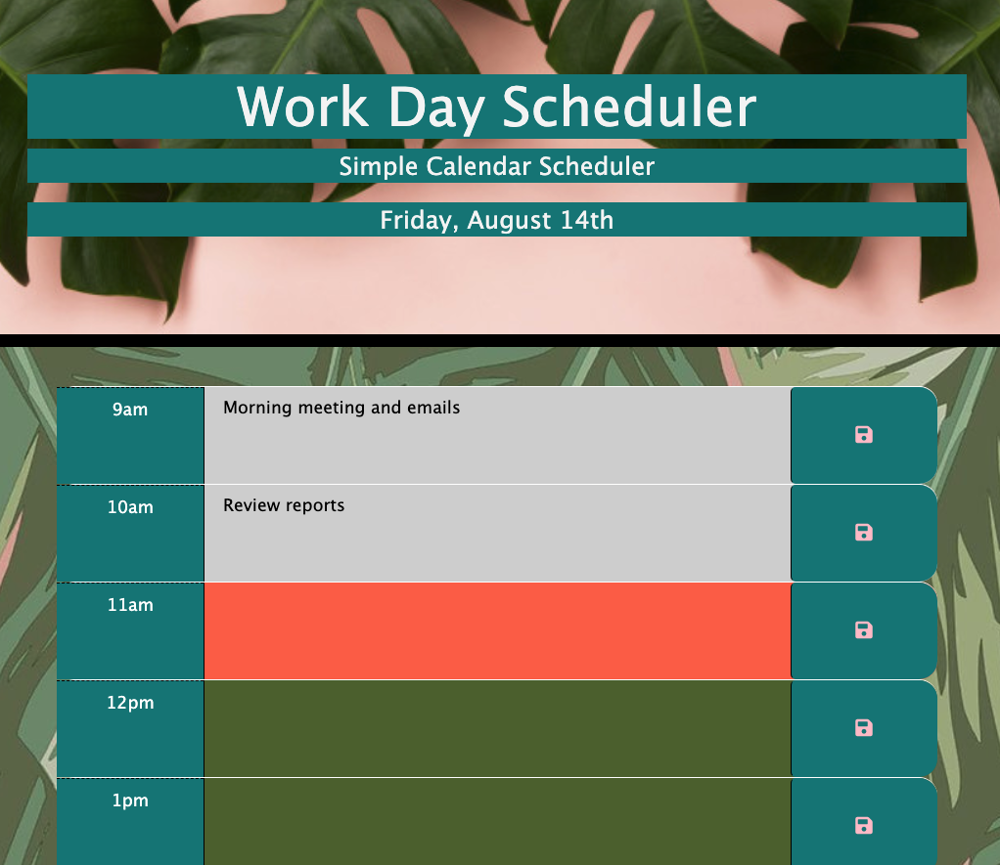

# 05 Third-Party APIs: Work Day Scheduler

I created a simple calendar application that allows the user to save events for each hour of the day. This app will run in the browser and feature dynamically updated HTML and CSS powered by jQuery.

I was inspired by a visit last year to "Cha Cha Matcha" in NYC's Nomad District: Pinks and Greens deliver a delightful tropical design element.

## Project Screenshot
